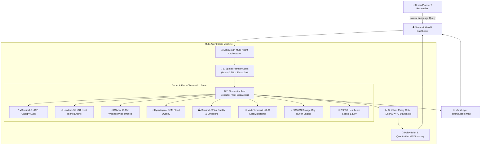

# 🌍 GeoLab-Agent: Autonomous Multi-Agent GeoAI Platform for Spatial Planning & Remote Sensing


[](https://www.python.org/downloads/)
[](https://github.com/langchain-ai/langgraph)
[](https://earthengine.google.com/)
[](https://opensource.org/licenses/MIT)
[](https://www.kuet.ac.bd/department/URP)

> **An autonomous Multi-Agent GeoAI framework that bridges Earth Observation Foundation Models, Graph Theory, and Large Language Models to automate Urban Spatial Analytics and evidence-based Policy Synthesis.**

Developed by researchers at the Department of **Urban and Regional Planning (URP), Khulna University of Engineering & Technology (KUET)**.

---

## 📌 Research Motivation & Problem Statement

Traditional urban planning and Geographic Information Systems (GIS) workflows suffer from three critical bottlenecks:
1. **High Manual Latency:** Acquiring, preprocessing, and analyzing multi-sensor satellite imagery (Sentinel-2, Landsat-9, Sentinel-5P) requires manual script orchestration.
2. **Disconnected Policy Formulation:** Quantitative spatial metrics (e.g., NDVI deficit, Surface Urban Heat Island intensity, 15-minute isochrones) often remain isolated from actionable urban policy documents and building codes.
3. **Lack of Agentic Automation:** Conventional GIS lacks reasoning capabilities to dynamically chain multi-modal spatial tools in response to ambiguous, high-level municipal planning inquiries.

**GeoLab-Agent** solves these challenges by introducing an end-to-end **Multi-Agent State Graph Architecture** that decomposes natural language planning inquiries, executes specialized geospatial tools, and synthesizes academic/municipal policy briefs adhering to **WHO, UN-Habitat, and IPCC guidelines**.

---

## 🏛️ System Architecture



---

## ✨ Key Features & Capabilities

* **🧠 Multi-Agent Spatial Orchestration (LangGraph):** 
  Cyclic state machine featuring a *Spatial Planner*, *Geospatial Executor*, and *Urban Policy Critic* with full execution traceability.
* **🛰️ Earth Observation & Thermal Remote Sensing:** 
  Automated calculation of **Sentinel-2 NDVI** (vegetative canopy per capita) and **Landsat-9 TIRS Land Surface Temperature (LST)** for Surface Urban Heat Island (SUHI) detection.
* **🔄 Multi-Temporal LULC & Urban Sprawl Analytics:**
  Multi-epoch satellite change detection analyzing impervious surface growth, deforestation, and water body shrinkage rates.
* **💧 Sponge City & Hydrological Runoff Modeling:**
  SCS-CN (Soil Conservation Service Curve Number) stormwater runoff depth estimation and distributed retention basin capacity sizing.
* **🏥 2SFCA Healthcare & Spatial Equity Indexing:**
  Two-Step Floating Catchment Area analysis evaluating emergency medical accessibility and identifying underserved community clusters.
* **🚶 15-Minute City & Graph Network Analytics (OSMnx):** 
  Non-Euclidean pedestrian isochrone mapping (5, 10, 15-minute walksheds) and transit stop density scoring.
* **🧪 Interactive Digital Twin 'What-If' Simulation Sandbox:**
  Live policy sliders for canopy targets, cool roofs, transit stops, and sponge retention with instant real-time microclimate recalculation.
* **💾 Multi-Format GIS & Municipal Report Exporter:**
  One-click export for **GeoJSON Layer Packages** (QGIS/ArcGIS), **Geospatial CSV Tables**, and **Printable HTML/PDF Municipal Briefs**.


---

## 📊 Benchmark & Comparative Advantage

| Feature / Metric | Conventional Desktop GIS (QGIS/ArcGIS) | Generic LLMs (ChatGPT / Claude) | **GeoLab-Agent (Ours)** |
| :--- | :---: | :---: | :---: |
| **Natural Language Spatial Querying** | ❌ No | 🟡 Text only (No spatial computation) | ✅ **Full Autonomous Execution** |
| **Direct Earth Observation Processing** | 🟡 Manual Scripts | ❌ No | ✅ **Automated Tool Dispatch** |
| **Dynamic Isochrone Catchment** | 🟡 Plugin Required | ❌ Hallucinates coordinates | ✅ **Exact OSMnx Topological Graph** |
| **URP / WHO Standard Compliance Audit**| ❌ Manual Calculation | 🟡 Generic Suggestions | ✅ **Automated Quantitative Benchmark** |
| **Interactive Multi-Layer Map Export** | 🟡 Manual Styling | ❌ No map rendering | ✅ **Real-time Folium/Leaflet Layers** |

---

## 🚀 Quickstart Guide

### 1. Clone the Repository
```bash
git clone https://github.com/your-username/GeoLab-Agent.git
cd GeoLab-Agent
```

### 2. Create and Activate Virtual Environment
```bash
# Windows PowerShell
python -m venv venv
.\venv\Scripts\Activate.ps1

# Linux / macOS
python3 -m venv venv
source venv/bin/activate
```

### 3. Install Dependencies
```bash
pip install -r requirements.txt
```

### 4. Configure Environment Variables (Optional)
Copy `.env.example` to `.env` and insert your free Google Gemini API key:
```bash
cp .env.example .env
```
*(Note: If no API key is provided, the platform automatically runs in robust **Synthetic GeoAI Sandbox Mode** with zero crashes).*

### 5. Launch the Web Dashboard
```bash
streamlit run app/main.py
```
Open your browser at `http://localhost:8501`.

---

## 🧪 Running Automated Tests

GeoLab-Agent includes unit test suites for both the geospatial tool registry and the multi-agent state graph:

```bash
# Run all tests
python -m unittest discover -s tests

# Test individual components
python tests/test_tools.py
python tests/test_agents.py
```

---

## 📁 Repository Structure

```text
GeoLab-Agent/
├── app/
│   └── main.py                     # Streamlit GeoAI web application
├── src/
│   ├── agents/
│   │   ├── __init__.py
│   │   ├── state.py                # LangGraph TypedDict state schema
│   │   ├── planner.py              # Spatial intent & tool decomposition
│   │   ├── executor.py             # Geospatial tool execution dispatcher
│   │   ├── critic.py               # Urban policy & WHO standard synthesis
│   │   └── workflow.py             # Compiled LangGraph state machine
│   └── tools/
│       ├── __init__.py
│       ├── gee_analytics.py        # Sentinel-2 NDVI, Landsat LST, Sentinel-5P, LULC
│       ├── network_analytics.py    # OSMnx 15-minute isochrones & transit
│       ├── vector_analytics.py     # Zoning vulnerability, flood overlay, Sponge City, 2SFCA
│       └── map_renderer.py         # Leaflet/Folium multi-layer builder
├── tests/
│   ├── test_tools.py               # Unit tests for geospatial analytics
│   └── test_agents.py              # Unit tests for agentic workflow
├── notebooks/
│   └── 01_geolab_agent_walkthrough.ipynb
├── requirements.txt
├── .env.example
├── .gitignore
├── LICENSE
└── README.md
```

---

## 🎓 Academic Citations & Contact

If you use **GeoLab-Agent** in your research or urban planning projects, please cite:

```bibtex
@article{geolabagent2026,
  title={GeoLab-Agent: Autonomous Multi-Agent GeoAI and Spatial LLM Framework for Urban Resilience and Remote Sensing Analytics},
  author={KUET URP GeoAI Research Initiative},
  year={2026},
  journal={Department of Urban and Regional Planning, Khulna University of Engineering & Technology (KUET)},
  url={https://github.com/your-username/GeoLab-Agent}
}
```

*For inquiries regarding graduate research collaboration or academic partnerships, please reach out via GitHub Issues or contact the URP Department at KUET.*

# GeoLab-Agent

