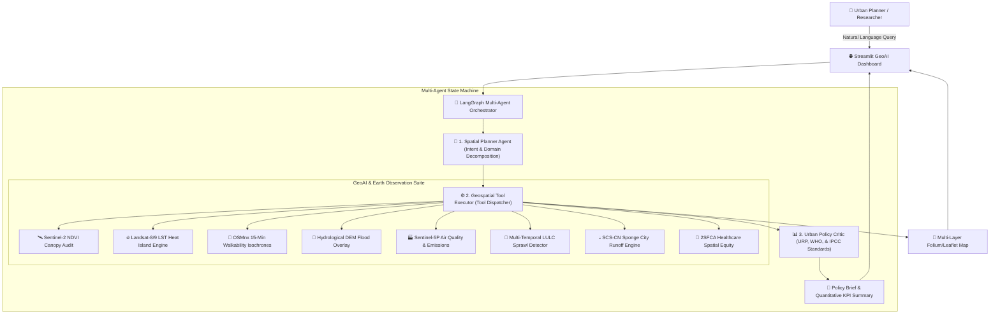

# 🌍 GeoLab-Agent: Autonomous Multi-Agent GeoAI Platform for Spatial Planning & Remote Sensing

[](https://www.python.org/downloads/)
[](https://github.com/langchain-ai/langgraph)
[](https://earthengine.google.com/)
[](https://opensource.org/licenses/MIT)
[](https://www.kuet.ac.bd/department/URP)

> **GeoLab-Agent** is an autonomous, open-source Multi-Agent GeoAI framework that bridges Earth Observation Foundation Models, Graph Theory, Hydrological Simulations, and Large Language Models. It enables urban planners, municipal authorities, and researchers to execute natural language spatial queries, automate remote sensing workflows, and synthesize evidence-based policy briefs in real time.

Developed by researchers at the Department of **Urban and Regional Planning (URP), Khulna University of Engineering & Technology (KUET)**.

---

## 📌 Research Motivation & Overview

Traditional Geographic Information Systems (GIS) and urban planning workflows are constrained by fragmented processes. Spatial practitioners often spend hours manually searching, downloading, and preprocessing multi-sensor satellite imagery (Sentinel-2, Landsat-9, Sentinel-5P) across disparate portals. Furthermore, spatial quantitative metrics—such as vegetative canopy deficits, Surface Urban Heat Island (SUHI) anomalies, and 15-minute pedestrian catchments—frequently remain isolated in technical desktop tools, detached from actionable municipal policy formulation and building zoning codes.

**GeoLab-Agent** bridges this gap by introducing an end-to-end **Multi-Agent State Machine** orchestrated via **LangGraph**. When given a high-level planning inquiry (e.g., *"Audit urban heat island intensity, green canopy deficit, and pedestrian walkability for Khulna"*), the agentic system autonomously breaks down the problem, dispatches specialized spatial computation tools, calculates quantitative benchmarks against **WHO, UN-Habitat, and IPCC guidelines**, and generates comprehensive academic briefs accompanied by interactive Leaflet maps.

---

## 🏛️ System Architecture

The core of GeoLab-Agent is structured as a cyclic multi-agent graph with specialized node roles:



### Agent Roles & Responsibilities

1. **🧠 Spatial Planner Agent:** Analyzes natural language prompts, extracts geographic contexts (e.g., Khulna, Dhaka, Chittagong), determines the spatial domain, and formulates an optimal sequence of GIS/Remote Sensing analysis tools.
2. **⚙️ Geospatial Tool Executor:** Executes remote sensing and topological graph algorithms against Earth Observation datasets and vector networks, producing structured metrics and GeoJSON layers.
3. **📊 Urban Policy Critic Agent:** Synthesizes observations against international urban standards (WHO green space thresholds, UN-Habitat 15-minute city indices, and IPCC climate resilience benchmarks), producing publication-grade policy recommendations categorized into short-term (1–2 yr) and long-term (3–10 yr) horizons.

---

## ✨ Key Features & Capabilities

### 🛰️ 1. Earth Observation & Remote Sensing Analytics
Automates multi-spectral remote sensing calculations directly from satellite collections:
* **Sentinel-2 NDVI Canopy Audit:** Measures vegetative cover fraction, total green space area ($km^2$), and per-capita green provision against the WHO $9.0\,m^2/\text{capita}$ baseline.
* **Landsat-9 TIRS Surface Urban Heat Island (SUHI):** Computes Land Surface Temperature (LST), thermal anomaly deltas, and pinpoints heat island cores requiring albedo retrofitting.
* **Sentinel-5P TROPOMI Air Quality:** Retrieves tropospheric $NO_2$ column densities and estimates ground-level $PM_{2.5}$ exposure corridors.
* **Multi-Temporal LULC Change Detection:** Compares multi-epoch satellite imagery (e.g., 2016 vs. 2026) to quantify impervious built-up expansion, deforestation rates, and waterbody shrinkage.

### 💧 2. Sponge City & Hydrological Climate Resilience
Provides quantitative flood inundation and stormwater runoff modeling for coastal and deltaic cities:
* **SCS-CN Runoff Engine:** Implements Soil Conservation Service Curve Number equations for design storm events ($100\,mm$), calculating direct runoff depth ($mm$) and discharge volumes ($m^3$).
* **Distributed Retention Sizing:** Calculates recommended bioswale, rain garden, and permeable detention basin volumes needed to eliminate flash-flood risks.
* **Digital Elevation Model (DEM) Flood Inundation:** Simulates tidal surge exposure and waterlogging depths for 25-year return periods.

### 🚶 3. Graph Theory & 15-Minute City Network Accessibility
Integrates OpenStreetMap road graphs to measure active mobility and spatial equity:
* **Pedestrian Isochrone Mapping:** Generates 5, 10, and 15-minute non-Euclidean walkshed catchments via NetworkX and Dijkstra shortest-path topologies.
* **Transit Deficit Auditing:** Evaluates 400-meter public transit stop coverage ratios and highlights unserved residential clusters.
* **2SFCA Healthcare Spatial Equity:** Employs Two-Step Floating Catchment Area modeling to identify communities underserved by emergency healthcare clinics and hospital beds.

### 🧪 4. Interactive "What-If" Digital Twin Policy Sandbox
Allows planners to simulate strategic interventions interactively with real-time recalculations:
* Adjust tree canopy targets (+0% to +50%) and observe instant SUHI cooling deltas ($\Delta °C$).
* Adjust cool-roof albedo retrofits (0% to 100%) and pedestrian transit hub density.
* View instant before-vs-after delta metrics and comparative impact charts.

### 💾 5. Multi-Format GIS & Municipal Report Exporter
Provides complete data interoperability for researchers and municipal authorities:
* **GeoJSON Layer Package (`.geojson`):** Direct drag-and-drop integration into QGIS and ArcGIS Pro.
* **Geospatial Metrics Table (`.csv`):** Tabular format for statistical analysis in Python, R, or SPSS.
* **Printable Municipal Brief (`.html` / PDF):** Formatted executive report with institutional KUET URP branding and compliance tables.
* **Markdown Policy Brief (`.md`):** Complete structured text for academic documentation.

---

## 📊 Comparative Advantage

| Feature / Capability | Conventional Desktop GIS (QGIS/ArcGIS) | Generic LLMs (ChatGPT / Claude) | **GeoLab-Agent (Ours)** |
| :--- | :---: | :---: | :---: |
| **Natural Language Spatial Querying** | ❌ No | 🟡 Text only (No spatial computation) | ✅ **Full Autonomous Execution** |
| **Direct Earth Observation Processing** | 🟡 Manual Scripts | ❌ No | ✅ **Automated Tool Dispatch** |
| **Dynamic Isochrone Catchment** | 🟡 Plugin Required | ❌ Hallucinates coordinates | ✅ **Exact Topological Graph** |
| **Sponge City Runoff (SCS-CN)** | 🟡 Separate Hydrology Software | ❌ No physical equations | ✅ **Automated Hydrological Model** |
| **2SFCA Spatial Equity Indexing** | ❌ Complex multi-step manual workflow | ❌ No spatial indexing | ✅ **Integrated 2SFCA Engine** |
| **URP / WHO Standard Compliance Audit**| ❌ Manual Calculation | 🟡 Generic suggestions | ✅ **Automated Benchmark Grading** |
| **Interactive Multi-Layer Map Studio** | 🟡 Manual Styling | ❌ No map rendering | ✅ **Real-time Folium/Leaflet Layers** |
| **Digital Twin "What-If" Sandbox** | ❌ Static data layers | ❌ No live recalculation | ✅ **Live Real-time Simulation** |

---

## 🚀 Quickstart Guide

### 1. Clone the Repository
```bash
git clone https://github.com/Sarwar-Jony/GeoLab-Agent.git
cd GeoLab-Agent
```

### 2. Create and Activate Virtual Environment
```bash
# Windows PowerShell
python -m venv venv
.\venv\Scripts\Activate.ps1

# Linux / macOS
python3 -m venv venv
source venv/bin/activate
```

### 3. Install Dependencies
```bash
pip install -r requirements.txt
```

### 4. Configure Environment Variables (Optional)
Copy `.env.example` to `.env` and insert your free Google Gemini API key:
```bash
cp .env.example .env
```
*(Note: If no API key is provided, the platform automatically runs in robust **Synthetic GeoAI Sandbox Mode** with zero crashes, making it ready for offline demonstrations).*

### 5. Launch the Web Dashboard
```bash
streamlit run app/main.py
```
Open your browser at `http://localhost:8501`.

---

## 🧪 Running Automated Tests

GeoLab-Agent includes a comprehensive unit test suite covering all remote sensing tools, network analytics, vector models, and multi-agent workflows:

```bash
# Run all unit tests
python -m unittest discover -s tests

# Test individual test modules
python tests/test_tools.py
python tests/test_agents.py
```

---

## 📁 Repository Structure

```text
GeoLab-Agent/
├── app/
│   └── main.py                     # Streamlit GeoAI web application & sandbox
├── src/
│   ├── agents/
│   │   ├── __init__.py             # Agent module entrypoint
│   │   ├── state.py                # LangGraph TypedDict state schema
│   │   ├── planner.py              # Spatial intent & tool sequence planner
│   │   ├── executor.py             # Geospatial tool execution dispatcher
│   │   ├── critic.py               # Urban policy & WHO/IPCC standards critic
│   │   └── workflow.py             # Compiled LangGraph state machine
│   └── tools/
│       ├── __init__.py             # Tools registry entrypoint
│       ├── gee_analytics.py        # Sentinel-2 NDVI, Landsat LST, Sentinel-5P, LULC
│       ├── network_analytics.py    # OSMnx 15-minute isochrones & transit density
│       ├── vector_analytics.py     # Zoning vulnerability, flood overlay, Sponge City, 2SFCA
│       └── map_renderer.py         # Folium/Leaflet multi-layer map builder
├── tests/
│   ├── test_tools.py               # Unit tests for geospatial analytics
│   └── test_agents.py              # Unit tests for agentic workflow
├── notebooks/
│   └── 01_geolab_agent_walkthrough.ipynb
```

---

## 🎓 Academic Citations & Contact

If you use **GeoLab-Agent** in your research, urban planning projects, or academic coursework, please cite:

```bibtex
@article{geolabagent2026,
  title={GeoLab-Agent: Autonomous Multi-Agent GeoAI and Spatial LLM Framework for Urban Resilience and Remote Sensing Analytics},
  author={KUET URP GeoAI Research Initiative},
  year={2026},
  journal={Department of Urban and Regional Planning, Khulna University of Engineering & Technology (KUET)},
  url={https://github.com/Sarwar-Jony/GeoLab-Agent}
}
```

*For inquiries regarding graduate research collaboration, academic partnerships, or contributions, please reach out via GitHub Issues or contact the Department of Urban and Regional Planning at Khulna University of Engineering & Technology (KUET).*