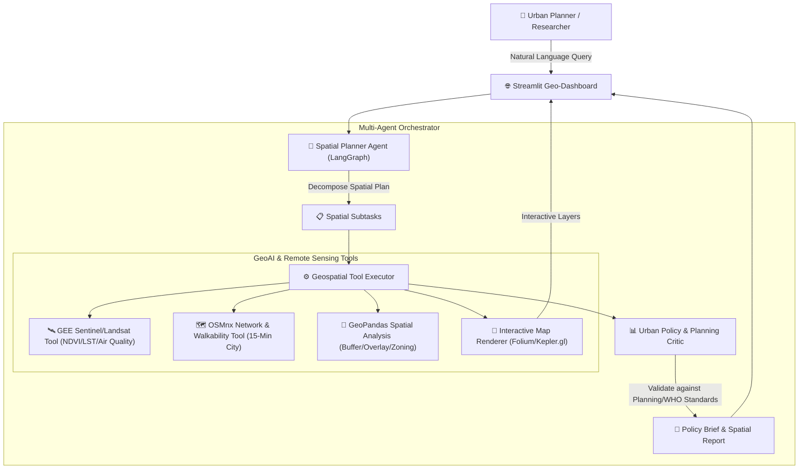

# UrbanGeo-Agent: Autonomous Multi-Agent GeoAI Platform for Spatial Planning & Remote Sensing

Build a scholarship-winning, publication-grade **Multi-Agent GeoAI & Spatial LLM platform** called **UrbanGeo-Agent**. The platform empowers urban planners and researchers to execute natural language spatial queries, orchestrate Earth Observation / GIS tools (GEE, GeoPandas, OSMnx, Rasterio), and generate academic policy reports with interactive maps.

---

## User Review Required

> [!IMPORTANT]
> **LLM API Provider Choice**:
> UrbanGeo-Agent will be architected to support **Google Gemini API** (`gemini-2.5-flash` / `gemini-2.5-pro`) by default (using `google-genai` / `langchain-google-genai`), while also supporting **OpenAI** (`gpt-4o`) via `.env` configuration.
> 
> **Offline / Demo Mock Mode**:
> For local testing and running on machines without active Earth Engine authentication or API keys, we will implement an automatic **Synthetic/Cached Geospatial Sandbox Mode** alongside the real GEE/OSMnx pipeline. This ensures anyone cloning the repository from GitHub can run and inspect the app immediately!

---

## Proposed System Architecture



---

## Proposed Changes

### 1. Project Scaffolding & Configuration

#### [NEW] [requirements.txt](file:///d:/Software Download/Portfolio Website/Research_geo/Geo-ai/requirements.txt)
- Core libraries: `langchain`, `langgraph`, `google-genai`, `langchain-google-genai`, `geopandas`, `shapely`, `earthengine-api`, `osmnx`, `rasterio`, `folium`, `streamlit`, `streamlit-folium`, `matplotlib`, `pydantic`, `python-dotenv`.

#### [NEW] [.env.example](file:///d:/Software Download/Portfolio Website/Research_geo/Geo-ai/.env.example)
- Configuration template for `GEMINI_API_KEY`, `GEE_PROJECT_ID`, and optional `OPENAI_API_KEY`.

#### [NEW] [.gitignore](file:///d:/Software Download/Portfolio Website/Research_geo/Geo-ai/.gitignore)
- Standard Python, GEE credentials, raster data, and `.env` exclusions.

---

### 2. Core Geospatial Tools (`src/tools/`)

#### [NEW] [gee_analytics.py](file:///d:/Software Download/Portfolio Website/Research_geo/Geo-ai/src/tools/gee_analytics.py)
- Sentinel-2 NDVI calculation (Green Space Canopy).
- Landsat-8/9 Thermal Infrared Surface Temperature (LST / Urban Heat Island).
- Sentinel-5P Tropospheric NO2 / Aerosol index for environmental air pollution.
- Fallback mock data generator for offline demos.

#### [NEW] [network_analytics.py](file:///d:/Software Download/Portfolio Website/Research_geo/Geo-ai/src/tools/network_analytics.py)
- OSMnx street network retrieval.
- Isochrone calculation (5, 10, 15-minute pedestrian walkability catchment).
- Accessibility and transit coverage index.

#### [NEW] [vector_analytics.py](file:///d:/Software Download/Portfolio Website/Research_geo/Geo-ai/src/tools/vector_analytics.py)
- Spatial buffer generation, zonal statistics, spatial intersections.
- Urban vulnerability indexing and flood zone hazard overlay.

#### [NEW] [map_renderer.py](file:///d:/Software Download/Portfolio Website/Research_geo/Geo-ai/src/tools/map_renderer.py)
- Leaflet / Folium interactive map builder with layer toggles (Satellite, Heatmap, Vector boundaries, Isochrones).

---

### 3. Multi-Agent Reasoning Engine (`src/agents/`)

#### [NEW] [state.py](file:///d:/Software Download/Portfolio Website/Research_geo/Geo-ai/src/agents/state.py)
- Pydantic state definition for LangGraph: user prompt, extracted bounding box, active layers, tool execution logs, spatial metrics, and final report.

#### [NEW] [planner.py](file:///d:/Software Download/Portfolio Website/Research_geo/Geo-ai/src/agents/planner.py)
- LLM prompt decomposition into structured GIS tool sequences.

#### [NEW] [executor.py](file:///d:/Software Download/Portfolio Website/Research_geo/Geo-ai/src/agents/executor.py)
- Autonomous tool execution router invoking `src/tools/`.

#### [NEW] [critic.py](file:///d:/Software Download/Portfolio Website/Research_geo/Geo-ai/src/agents/critic.py)
- Domain-specific Urban Planning synthesis against URP and WHO benchmarks (e.g., WHO recommended green space per capita, UHI mitigation recommendations, zoning setbacks).

#### [NEW] [workflow.py](file:///d:/Software Download/Portfolio Website/Research_geo/Geo-ai/src/agents/workflow.py)
- LangGraph compiled multi-agent state graph orchestrator.

---

### 4. Interactive Web Application (`app/`)

#### [NEW] [main.py](file:///d:/Software Download/Portfolio Website/Research_geo/Geo-ai/app/main.py)
- Streamlit application featuring:
  - Dark-mode professional GIS dashboard.
  - Multi-turn conversational spatial prompt interface.
  - Split-screen live Folium map + real-time tool execution logs.
  - Instant PDF/Markdown downloadable Urban Planning Policy Brief.
  - Pre-configured one-click research scenarios (e.g., *Khulna Urban Heat & Green Space Audit*, *Dhaka 15-Minute City Walkability*, *Chittagong Flood Vulnerability*).

---

### 5. Research & Documentation Artifacts

#### [NEW] [README.md](file:///d:/Software Download/Portfolio Website/Research_geo/Geo-ai/README.md)
- SOTA GitHub documentation:
  - Research Abstract & Motivation (URP + GeoAI).
  - Mermaid Architecture Diagram.
  - Benchmark comparison and tool capability matrix.
  - Docker and manual installation steps.
  - Cold Email / Academic Citation guide.

#### [NEW] [notebooks/01_urbangeo_agent_walkthrough.ipynb](file:///d:/Software Download/Portfolio Website/Research_geo/Geo-ai/notebooks/01_urbangeo_agent_walkthrough.ipynb)
- Interactive Jupyter Notebook showing step-by-step agentic execution for academic researchers.

---

## Verification Plan

### Automated Tests
1. **Tool Unit Tests:**
   ```bash
   python -m unittest discover -s tests
   ```
2. **End-to-End Agent Execution Test:**
   - Execute a headless query script simulating a full LangGraph run:
   ```bash
   python -m src.agents.workflow --test
   ```

### Manual & UI Verification
1. Launch the Streamlit dashboard locally:
   ```bash
   streamlit run app/main.py
   ```
2. Test interactive queries and inspect generated Leaflet maps, isochrone layers, and generated planning reports.
